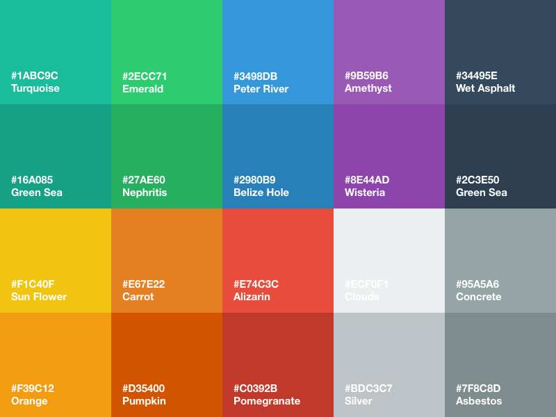

# 常用公共样式

### Flat-UI 色表

> 链接地址：[Flat-UI](https://flatuicolors.com/palette/defo)



vue + element-ui 本来已经够简单了，偏偏有人（没错，就是我）还想更简单些，那就来一份公共样式吧，整理了一些常用的记录下来，常见的色值可以取 Flat-UI 的色值：

```less
// 变量
@mainColor: #3498db;
@red: #e74c3c;
@yellow: #f1c40f;
@green: #2ecc71;
@grey: #f2f2f2;
// 字体颜色
.c9 { color: #999; }
.c6 { color: #666; }
.c-fff, .c-white { color: #fff; }
.c-blue { color: @mainColor !important; }
.c-red { color: @red !important; }
.c-yellow { color: @yellow !important; }
.c-green { color: @green !important; }
// 字重
.bold,.f600 { font-weight: bold !important; }
.normal,.f400 { font-weight: normal !important; }
// 字体尺寸
.fz10 { font-size: 10px; }
.fz12 { font-size: 12px; }
.fz14 { font-size: 14px; }
.fz16 { font-size: 16px; }
.fz18 { font-size: 18px; }
.fz20 { font-size: 20px; }
.fz22 { font-size: 22px; }
.fz24 { font-size: 24px; }
.fz26 { font-size: 26px; }
.fz28 { font-size: 28px; }
.fz30 { font-size: 30px; }
.fz32 { font-size: 32px; }
// 背景颜色
.bgc-white,.bgc-fff { background-color: #fff; }
.bgc-grey { background-color: @grey; }
.bgc-blue { background-color: @mainColor; }
.bgc-yellow { background-color: @yellow; }
.bgc-red { background-color: @red; }
.bgc-green { background-color: @green; }
// 圆角
.bdr2 { border-radius: 2px; }
.bdr4 { border-radius: 4px; }
.bdr8 { border-radius: 8px; }
.bdr50p { border-radius: 50%; }
// 布局方式
.flex { display: flex; align-items: center; }
.zhong { display: flex; align-items: center; justify-content: center; }
.space-between { display: flex; justify-content: space-between; align-items: center; }
.space-around { display: flex; justify-content: space-around; align-items: center; }
.flex-warp { display: flex; align-items: center; flex-wrap: wrap; }
.flex-col { display: flex; flex-direction: column; align-items: flex-start !important; }
.flex-end { display: flex; justify-content: flex-end; }
.flex-center { display: flex; justify-content: center; }
.db,.show { display: block; }
.dib { display: inline-block; }
.hide { display: none; }
.fl,.pull-left { float: left; }
.fr,.pull-right { float: right; }
// margin值
.m0 { margin: 0px !important; }
.mt0 { margin-top: 0px !important; }
.mb0 { margin-bottom: 0px !important; }
.ml0 { margin-left: 0px !important; }
.mr0 { margin-right: 0px !important; }
.m5 { margin: 5px !important; }
.mt5 { margin-top: 5px !important; }
.mb5 { margin-bottom: 5px !important; }
.ml5 { margin-left: 5px !important; }
.mr5 { margin-right: 5px !important; }
.m10 { margin: 10px !important; }
.mt10 { margin-top: 10px !important; }
.mb10 { margin-bottom: 10px !important; }
.ml10 { margin-left: 10px !important; }
.mr10 { margin-right: 10px !important; }
.m15 { margin: 15px !important; }
.mt15 { margin-top: 15px !important; }
.mb15 { margin-bottom: 15px !important; }
.ml15 { margin-left: 15px !important; }
.mr15 { margin-right: 15px !important; }
.m20 { margin: 20px !important; }
.mt20 { margin-top: 20px !important; }
.mb20 { margin-bottom: 20px !important; }
.ml20 { margin-left: 20px !important; }
.mr20 { margin-right: 20px !important; }
.m25 { margin: 25px !important; }
.mt25 { margin-top: 25px !important; }
.mb25 { margin-bottom: 25px !important; }
.ml25 { margin-left: 25px !important; }
.mr25 { margin-right: 25px !important; }
.m30 { margin: 30px !important; }
.mt30 { margin-top: 30px !important; }
.mb30 { margin-bottom: 30px !important; }
.ml30 { margin-left: 30px !important; }
.mr30 { margin-right: 30px !important; }
.m50 { margin: 50px !important; }
.mt50 { margin-top: 50px !important; }
.mb50 { margin-bottom: 50px !important; }
.ml50 { margin-left: 50px !important; }
.mr50 { margin-right: 50px !important; }
// padding值
.p0 { padding: 0 !important; }
.pt0 { padding-top: 0 !important; }
.pr0 { padding-right: 0 !important; }
.pb0 { padding-bottom: 0 !important; }
.pl0 { padding-left: 0 !important; }
.p5 { padding: 5px; }
.pt5 { padding-top: 5px; }
.pr5 { padding-right: 5px; }
.pb5 { padding-bottom: 5px; }
.pl5 { padding-left: 5px; }
.p10 { padding: 10px; }
.pt10 { padding-top: 10px; }
.pr10 { padding-right: 10px; }
.pb10 { padding-bottom: 10px; }
.pl10 { padding-left: 10px; }
.p15 { padding: 15px; }
.pt15 { padding-top: 15px; }
.pr15 { padding-right: 15px; }
.pb15 { padding-bottom: 15px; }
.pl15 { padding-left: 15px; }
.p20 { padding: 20px; box-sizing: border-box; }
.pt20 { padding-top: 20px; }
.pr20 { padding-right: 20px; }
.pb20 { padding-bottom: 20px; }
.pl20 { padding-left: 20px; }
.p30 { padding: 30px; box-sizing: border-box; }
.pt30 { padding-top: 30px; }
.pr30 { padding-right: 30px; }
.pb30 { padding-bottom: 30px; }
.pl30 { padding-left: 30px; }
.pb50 { padding-bottom: 50px; }
.pl50 { padding-left: 50px; }
.pl120 { padding-left: 120px; }
.pl150 { padding-left: 150px; }
.pt50 { padding-top: 50px; }
// 文本线格式
.overline { text-decoration: overline; }
.line-through { text-decoration: line-through; }
.underline { text-decoration: underline; }
.blink { text-decoration: blink; }
// 字体对齐方式
.tac { text-align: center; justify-content: center; }
.tal { text-align: left !important; }
.tar { text-align: right !important; }
// 宽度
.w10p { width: 10%; }
.w20p { width: 20%; }
.w25p { width: 25%; }
.w30p { width: 30%; }
.w40p { width: 40%; }
.w50p { width: 50%; }
.w60p { width: 60%; }
.w70p { width: 70%; }
.w75p { width: 75%; }
.w80p { width: 80%; }
.w90p { width: 90%; }
.w100p { width: 100%; }
.w20 { width: 20px; }
.w25 { width: 25px; }
.w50 { width: 50px; }
.w75 { width: 75px; }
.w100 { width: 100px; }
.w125 { width: 125px; }
.w150 { width: 150px; }
.w175 { width: 175px; }
.w200 { width: 200px; }
.w210 { width: 210px; }
.w220 { width: 220px; }
.w250 { width: 250px; }
.w275 { width: 275px; }
.w300 { width: 300px; }
.w325 { width: 325px; }
.w350 { width: 350px; }
.w375 { width: 375px; }
.w400 { width: 400px; }
.w450 { width: 450px; }
.w500 { width: 500px; }
.w600 { width: 600px; }
.w750 { width: 750px; }
.w1000 { width: 1000px; }
// 高度
.h15 { height: 15px; }
.h10 { height: 10px !important; }
.h20 { height: 20px !important; }
.h25 { height: 25px !important; }
.h30 { height: 30px !important; }
.h40 { height: 40px !important; }
.h50 { height: 50px !important; }
.h60 { height: 60px !important; }
.h70 { height: 70px !important; }
.h75 { height: 75px !important; }
.h80 { height: 80px !important; }
.h90 { height: 90px !important; }
.h100 { height: 100px !important; }
.h125 { height: 125px !important; }
.h150 { height: 150px !important; }
.h10p { height: 10%; }
.h20p { height: 20%; }
.h30p { height: 30%; }
.h40p { height: 40%; }
.h50p { height: 50%; }
.h60p { height: 60%; }
.h70p { height: 70%; }
.h80p { height: 80%; }
.h90p { height: 90%; }
.h100p { height: 100%; }
.h10vh { height: 10vh; }
.h20vh { height: 20vh; }
.h30vh { height: 30vh; }
.h40vh { height: 40vh; }
.h50vh { height: 50vh; }
.h60vh { height: 60vh; }
.h70vh { height: 70vh; }
.h80vh { height: 80vh; }
.h90vh { height: 90vh; }
.h100vh { height: 100vh; }
.h600 { height: 600px; }
.h800 { height: 800px; }
// 行高
.lh16 { line-height: 16px; }
.lh18 { line-height: 18px; }
.lh20 { line-height: 20px; }
.lh22 { line-height: 22px; }
.lh25 { line-height: 25px; }
.lh30 { line-height: 30px; }
// 定位
.relative { position: relative; }
.point { cursor: pointer !important; user-select: none; }
/* 解决文字超出溢出问题 */
.text-cut { overflow: hidden; white-space: nowrap; text-overflow: ellipsis; -webkit-line-clamp: 2; -webkit-box-orient: vertical; }
```
