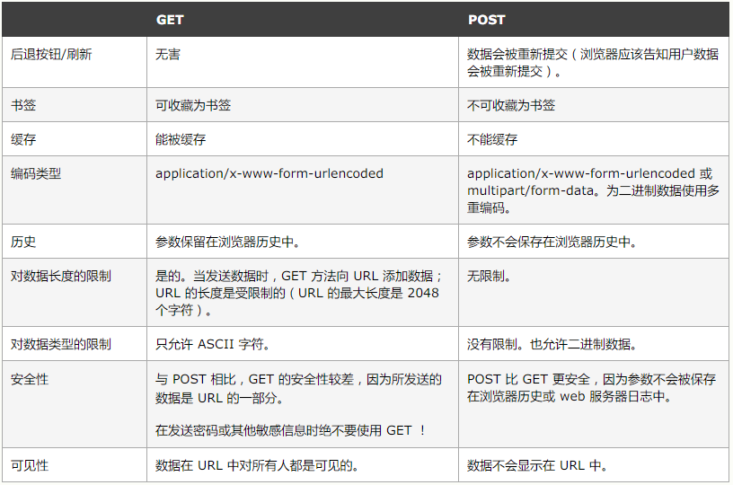

# 谈谈 get 和 post 的区别

> 写这篇文章的初衷：首先面试的时候偶尔会被问到，能答上来但答不全，其次前端使用 get 和 post 可能每天都会用到，或者说每个需求都会用到，深入了解它们之间的区别有助于开发。然而在 google 之后才看到很多高赞的文章说实则 get 和 post 并没有本质区别，个人对于这种说法不敢苟同，所以记下自己的一些想法。

#### 标准说法

在一开始学习相关知识的时候我了解到的大概是各种官方网站上的标准答案，自己面试回答的也基本上是自己从标准答案中得到的模糊印象，那么首先看看标准答案关于 get 和 post 的对比，然后再一一分析：

[w3school](https://www.w3school.com.cn/tags/html_ref_httpmethods.asp)

::: tip
GET - 从指定的资源请求数据。

POST - 向指定的资源提交要被处理的数据。
:::

这个表格列得很详细，够全面。但是网上很多高赞的文章却不是这个说法。

#### 坊间说法

坊间的说法一般表示 get 和 post 只是 HTTP 中的两种请求方式，而 HTTP 协议是基于 TCP/IP 的应用层协议，无论 get 还是 post，用的都是同一个传输层协议，所以在传输上它们没有区别。

还有的说法表示 get 产生一个 TCP 数据包，post 产生两个 TCP 数据包。

我也不是想证明这些说法是否正确，只是想说说自己在这方面的想法。

#### 个人看法

首先就坊间说法谈谈，一种说法由 get 和 post 都属于 HTTP 的请求方式，然后 HTTP 又基于 TCP 来证明它们的本质无差异。我觉得有一些牵强，既然说了是 HTTP 的两种请求方式就已经表明了它们是存在差异的，这样追本溯源就好似拿同是哺乳动物的人和狗来说它们本质无差别一样。

另外至于说产生的 TCP 数据包不同，我个人正在学习上野宣《图解HTTP》，只是一个前端的菜鸟，并不知道这种说法是否正确，但就说法而言也觉得有些本末倒置，无论从面试官的角度和工作的角度去看，这样的说法虽然标新立异，但不免有些哗众取宠。

我的看法是既然 get 和 post 是 HTTP 的两种请求方式，那就从 HTTP 方面来比较一下：

1. 安全方面

HTTP 在网络上是明文传输的，因此 post 不见得比 get 更安全，只要在网络节点上捉包，就能完整的获取数据报文。

2. 参数位置

规范的做法是 get 参数放在 url 中，post 参数放在 request body 中，实际上我们也可以不这么多，工作中我就遇到过不止一次后台开发人员要求 post 参数部分放 url，部分放 request body的情况，当然这是不规范的做法，我一般是拒绝的。既然有了规范，我认为这属于它们之间的差异。

3. 大小限制

get 和 post 确实有比较大的传输限制差异，但这其实不是 HTTP 规定的差异，而是由浏览器和服务器限制的，大多数的浏览器 url 长度会限制在 2k 个字符以内（服务器默认接收的字符也有限制），而 post 在服务器端同样会有限制，一般在 64k 以内。

4. 编码类型

这个属于记忆标准答案，从上表中可以看出。get 的编码类型只能是 application/x-www-form-urlencoded，post 可以是多种编码类型，用得比较多的是 application/x-www-form-urlencoded、application/json、multipart/form-data 等。

5. 数据类型

属于标准答案。get 只允许 ASCII 字符，post 没有限制。

<Vssue :title="$title" />
