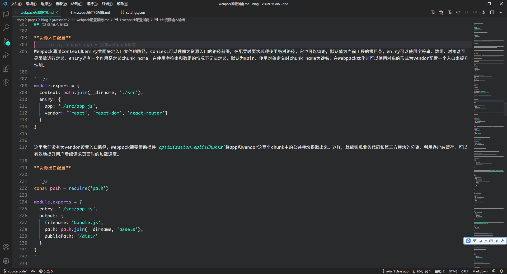

# VSCode 插件和配置

::: danger
**从 Visual Studio Code 1.48开始可以授权微软或 Github 登录，并且同步用户设置了，包括 Setting.json 文件、扩展程序等。因此，下面的配置不再是必须的！！！**
:::

> vscode 是一款非常好的编辑器, 它的好很大一部分取决于丰富的插件库, 由于安装的插件比较多, 配置也比较多(个人喜欢瞎弄), 这里做一个插件和配置的备份, 纯粹个人配置, 做个参考

### 插件

- **Auto Close Tag**

  自动闭合 HTML 标签

- **Auto Rename Tag**

- **Better Comments**

  注释插件

- **Bracket Pair Colorizer**

  允许使用颜色标识匹配的括号

- **Chinese (Simplified) Language Pack for Visual Studio Code**

  适用于 VS Code 的中文（简体）语言包

- **Code Runner**

  运行代码片段（需要指定运行语言使用`Ctrl + Alt + J`）

- **Debugger for Chrome**

  用于在 Google Chrome 浏览器或支持 Chrome DevTools 协议的其他目标中调试 JavaScript 代码的 VS Code 扩展

- **ESLint**

  提高代码可读性、统一性，适合协作开发

- **Git History**

- **GitLens — Git supercharged**

  增强 Visual Studio 代码内置的 Git 功能

- **language-stylus**

  支持 stylus 高亮

- **LeetCode**

- **Material Icon Theme**

- **npm**

  支持运行文件中定义的 npm 脚本 package.json 并根据定义的依赖项验证已安装的模块。

- **npm Intellisense**

  在 import 语句中自动填充 npm 模块

- **Panda Theme**

  熊猫主题

- **Path Intellisense**

  自动填充文件名

- **Prettier - Code formatter**

  美化 javascript，JSON，CSS，Sass，和 HTML 在 Visual Studio 代码

- **Sass**

  scss 插件

- **Vetur**

  vue 工具

- **vscode-pdf**

- **Vue 2 Snippets**

  vue 2.x 语法提示

- **React-Native/React/Redux snippets for es6/es7**

  react 语法插件

### 配置 (setting.json)

```json
{
  "editor.tabSize": 2,
  "editor.wordWrap": "on",
  "editor.fontLigatures": true,
  "editor.lineHeight": 26,
  "editor.fontFamily": "Monaco, Consolas",
  "editor.letterSpacing": 0.5,
  "editor.fontSize": 16,
  "editor.minimap.renderCharacters": false,
  "files.insertFinalNewline": true,
  "workbench.settings.editor": "json",
  "breadcrumbs.enabled": false,
  "workbench.iconTheme": "material-icon-theme",
  "terminal.integrated.shell.windows": "C:\\Program Files\\PowerShell\\7\\pwsh.exe", // git 树状显示
  "code-runner.runInTerminal": true, // 在命令行运行code runner
  "editor.codeActionsOnSave": {
    "source.fixAll.eslint": true
  },
  "eslint.validate": [
    "javascript",
    "javascriptreact",
    "typescript",
    "typescriptreact",
    "html",
    "vue"
  ],
  "[javascript]": {
    "editor.defaultFormatter": "esbenp.prettier-vscode"
  },
  "[vue]": {
    "editor.defaultFormatter": "esbenp.prettier-vscode"
  },
  "workbench.colorTheme": "Panda Syntax",
  "leetcode.endpoint": "leetcode-cn",
  "leetcode.hint.configWebviewMarkdown": false,
  "leetcode.workspaceFolder": "d:\\linhe\\leetCode",
  "leetcode.defaultLanguage": "javascript",
  "leetcode.hint.commentDescription": false,
  "gitlens.views.repositories.files.layout": "tree",
  "leetcode.hint.commandShortcut": false
}

```

### 主题

上面的配置文件里有--- [Panda Syntax](https://marketplace.visualstudio.com/items?itemName=tinkertrain.theme-panda)，如图：



<Vssue :title="$title" />
