# 彻底理解浏览器的缓存机制

> 本文转载自： https://heyingye.github.io/2018/04/16/彻底理解浏览器的缓存机制, 个人觉得讲解得很详细很透彻,经博主同意转载分享给大家。

补充一张神图：

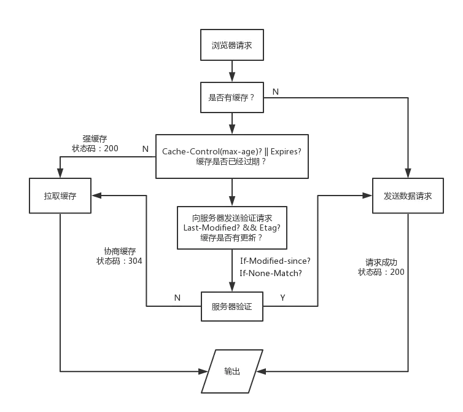

### 概述
浏览器的缓存机制也就是我们说的HTTP缓存机制，其机制是根据HTTP报文的缓存标识进行的，所以在分析浏览器缓存机制之前，我们先使用图文简单介绍一下HTTP报文，HTTP报文分为两种：
+ HTTP请求(Request)报文，报文格式为：请求行 – HTTP头(通用信息头，请求头，实体头) – 请求报文主体(只有`POST`才有报文主体)，如下图

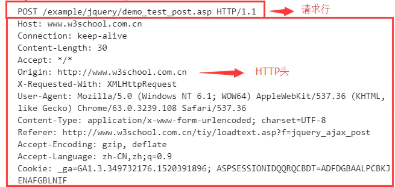

+ HTTP响应(Response)报文，报文格式为：状态行 – HTTP头(通用信息头，响应头，实体头) – 响应报文主体，如下图

> 注：通用信息头指的是请求和响应报文都支持的头域，分别为`Cache-Control`、`Connection`、`Date`、`Pragma`、`Transfer-Encoding`、`Upgrade`、`Via`；实体头则是实体信息的实体头域，分别为`Allow`、`Content-Base`、`Content-Encoding`、`Content-Language`、`Content-Length`、`Content-Location`、`Content-MD5`、`Content-Range`、`Content-Type`、`Etag`、`Expires`、`Last-Modified`、`extension-header`。这里只是为了方便理解，将通用信息头，响应头/请求头，实体头都归为了HTTP头。

以上的概念在这里我们不做多讲解，只简单介绍，有兴趣的童鞋可以自行研究。

### 缓存过程分析
浏览器与服务器通信的方式为应答模式，即是：浏览器发起HTTP请求 – 服务器响应该请求。那么浏览器第一次向服务器发起该请求后拿到请求结果，会根据响应报文中HTTP头的缓存标识，决定是否缓存结果，是则将请求结果和缓存标识存入浏览器缓存中，简单的过程如下图：

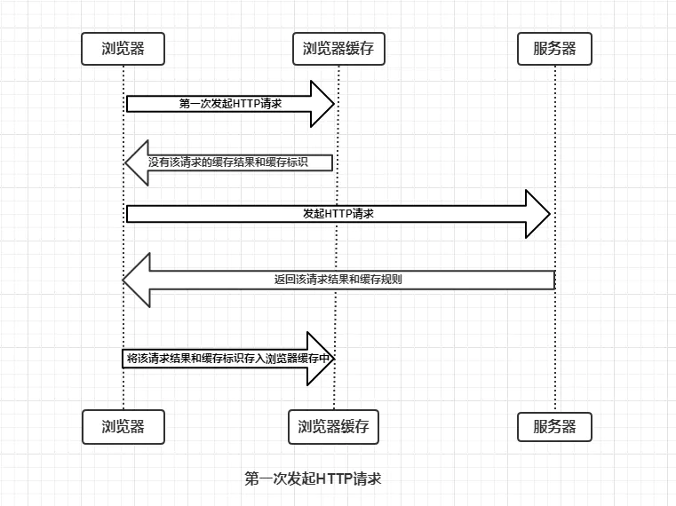

由上图我们可以知道：
+ 浏览器每次发起请求，都会先在浏览器缓存中查找该请求的结果以及缓存标识
+ 浏览器每次拿到返回的请求结果都会将该结果和缓存标识存入浏览器缓存中

以上两点结论就是浏览器缓存机制的关键，他确保了每个请求的缓存存入与读取，只要我们再理解浏览器缓存的使用规则，那么所有的问题就迎刃而解了，本文也将围绕着这点进行详细分析。为了方便大家理解，这里我们根据是否需要向服务器重新发起HTTP请求将缓存过程分为两个部分，分别是**强制缓存**和**协商缓存** 。

### 强制缓存
强制缓存就是向浏览器缓存查找该请求结果，并根据该结果的缓存规则来决定是否使用该缓存结果的过程，强制缓存的情况主要有三种(暂不分析协商缓存过程)，如下：
+ 不存在该缓存结果和缓存标识，强制缓存失效，则直接向服务器发起请求（跟第一次发起请求一致），如下图：

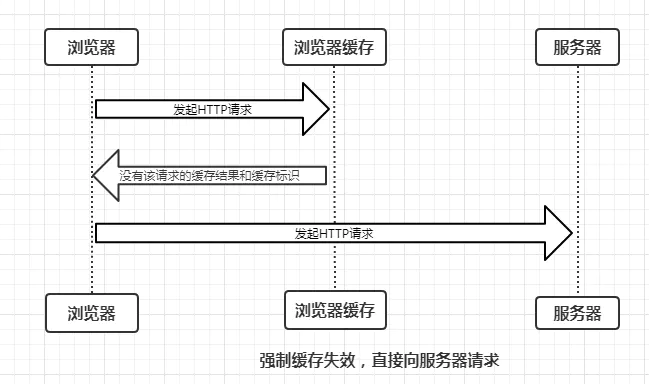

+ 存在该缓存结果和缓存标识，但该结果已失效，强制缓存失效，则使用协商缓存(暂不分析)，如下图

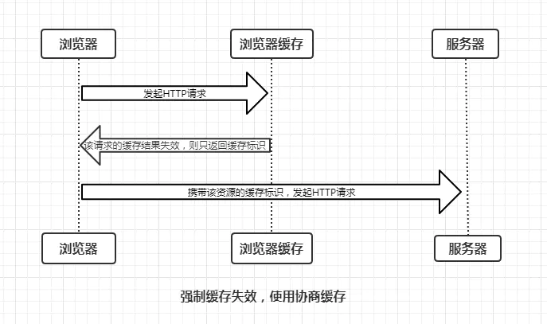

+ 存在该缓存结果和缓存标识，且该结果尚未失效，强制缓存生效，直接返回该结果，如下图

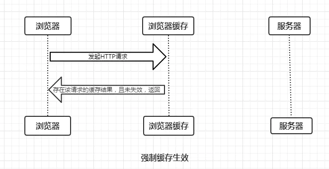

> 那么强制缓存的缓存规则是什么？

当浏览器向服务器发起请求时，服务器会将缓存规则放入HTTP响应报文的HTTP头中和请求结果一起返回给浏览器，控制强制缓存的字段分别是`Expires`和`Cache-Control`，其中`Cache-Control`优先级比`Expires`高。

#### Expires
`Expires`是HTTP/1.0控制网页缓存的字段，其值为服务器返回该请求结果缓存的到期时间，即再次发起该请求时，如果客户端的时间小于`Expires`的值时，直接使用缓存结果。
> `Expires`是HTTP/1.0的字段，但是现在浏览器默认使用的是HTTP/1.1，那么在HTTP/1.1中网页缓存还是否由`Expires`控制？

到了HTTP/1.1，Expire已经被`Cache-Control`替代，原因在于`Expires`控制缓存的原理是使用客户端的时间与服务端返回的时间做对比，那么如果客户端与服务端的时间因为某些原因（例如时区不同；客户端和服务端有一方的时间不准确）发生误差，那么强制缓存则会直接失效，这样的话强制缓存的存在则毫无意义，那么`Cache-Control`又是如何控制的呢？

#### Cache-Control
在HTTP/1.1中，`Cache-Control`是最重要的规则，主要用于控制网页缓存，主要取值为：
+ `public`：所有内容都将被缓存（客户端和代理服务器都可缓存）
+ `private`：所有内容只有客户端可以缓存，`Cache-Control`的默认取值
+ `no-cache`：客户端缓存内容，但是是否使用缓存则需要经过协商缓存来验证决定
+ `no-store`：所有内容都不会被缓存，即不使用强制缓存，也不使用协商缓存
+ `max-age=xxx (xxx is numeric)`：缓存内容将在xxx秒后失效
接下来，我们直接看一个例子，如下：

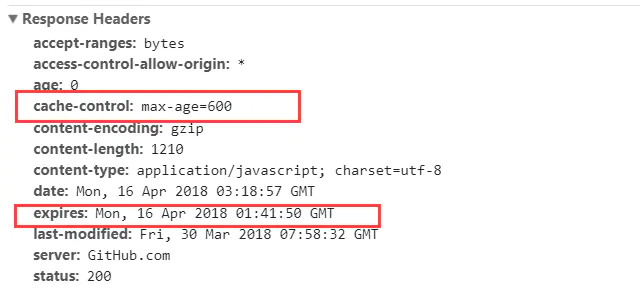

由上面的例子我们可以知道：
+ HTTP响应报文中`expires`的时间值，是一个绝对值
+ HTTP响应报文中`Cache-Control`为max-age=600，是相对值
由于`Cache-Control`的优先级比`expires`高，那么直接根据`Cache-Control`的值进行缓存，意思就是说在600秒内再次发起该请求，则会直接使用缓存结果，强制缓存生效。
> 注：在无法确定客户端的时间是否与服务端的时间同步的情况下，`Cache-Control`相比于`expires`是更好的选择，所以同时存在时，只有`Cache-Control`生效。

了解强制缓存的过程后，我们拓展性的思考一下：
> 浏览器的缓存存放在哪里，如何在浏览器中判断强制缓存是否生效？

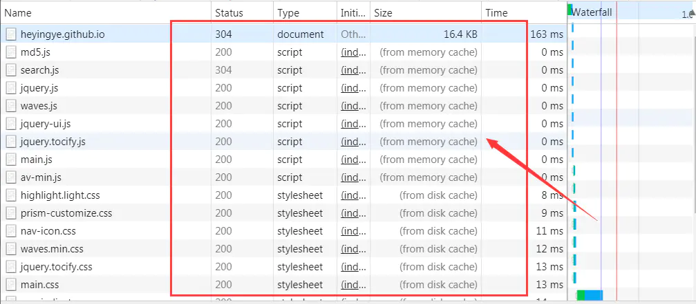

这里我们以博客的请求为例，状态码为灰色的请求则代表使用了强制缓存，请求对应的Size值则代表该缓存存放的位置，分别为from memory cache 和 from disk cache。
> 那么from memory cache 和 from disk cache又分别代表的是什么呢？什么时候会使用from disk cache，什么时候会使用from memory cache呢？

from memory cache代表使用内存中的缓存，from disk cache则代表使用的是硬盘中的缓存，浏览器读取缓存的顺序为memory –> disk。
虽然我已经直接把结论说出来了，但是相信有不少人对此不能理解，那么接下来我们一起详细分析一下缓存读取问题，这里仍让以我的博客为例进行分析：
访问https://heyingye.github.io/ –> 200 –> 关闭博客的标签页 –> 重新打开https://heyingye.github.io/ –> 200(from disk cache) –> 刷新 –> 200(from memory cache)
过程如下：
+ 访问https://heyingye.github.io/

+ 关闭博客的标签页
+ 重新打开https://heyingye.github.io/

+ 刷新

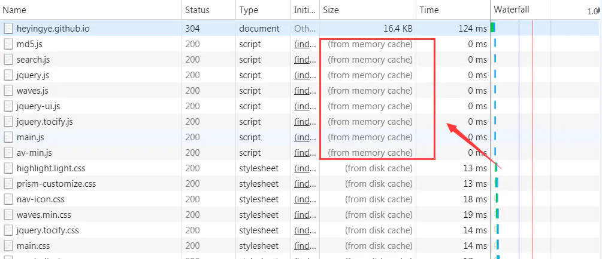

> 看到这里可能有人小伙伴问了，最后一个步骤刷新的时候，不是同时存在着from disk cache和from memory cache吗？

对于这个问题，我们需要了解内存缓存(from memory cache)和硬盘缓存(from disk cache)，如下:
+ 内存缓存(from memory cache)：内存缓存具有两个特点，分别是快速读取和时效性：
  + 快速读取：内存缓存会将编译解析后的文件，直接存入该进程的内存中，占据该进程一定的内存资源，以方便下次运行使用时的快速读取。
  + 时效性：一旦该进程关闭，则该进程的内存则会清空。
+ 硬盘缓存(from disk cache)：硬盘缓存则是直接将缓存写入硬盘文件中，读取缓存需要对该缓存存放的硬盘文件进行I/O操作，然后重新解析该缓存内容，读取复杂，速度比内存缓存慢。
在浏览器中，浏览器会在js和图片等文件解析执行后直接存入内存缓存中，那么当刷新页面时只需直接从内存缓存中读取(from memory cache)；而css文件则会存入硬盘文件中，所以每次渲染页面都需要从硬盘读取缓存(from disk cache)。

### 协商缓存
协商缓存就是强制缓存失效后，浏览器携带缓存标识向服务器发起请求，由服务器根据缓存标识决定是否使用缓存的过程，主要有以下两种情况：
+ 协商缓存生效，返回304，如下

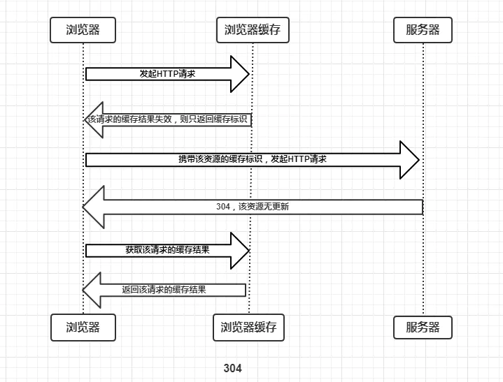

+ 协商缓存失效，返回200和请求结果结果，如下

同样，协商缓存的标识也是在响应报文的HTTP头中和请求结果一起返回给浏览器的，控制协商缓存的字段分别有：`Last-Modified / If-Modified-Since`和`Etag / If-None-Match`，其中`Etag / If-None-Match`的优先级比`Last-Modified / If-Modified-Since`高。

#### Last-Modified / If-Modified-Since

+ `Last-Modified`是服务器响应请求时，返回该资源文件在服务器最后被修改的时间，如下。

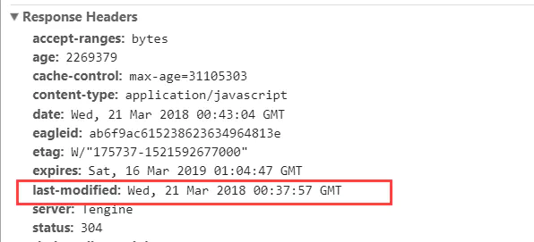

+ `If-Modified-Since`则是客户端再次发起该请求时，携带上次请求返回的`Last-Modified`值，通过此字段值告诉服务器该资源上次请求返回的最后被修改时间。服务器收到该请求，发现请求头含有`If-Modified-Since`字段，则会根据`If-Modified-Since`的字段值与该资源在服务器的最后被修改时间做对比，若服务器的资源最后被修改时间大于`If-Modified-Since`的字段值，则重新返回资源，状态码为200；否则则返回304，代表资源无更新，可继续使用缓存文件，如下。

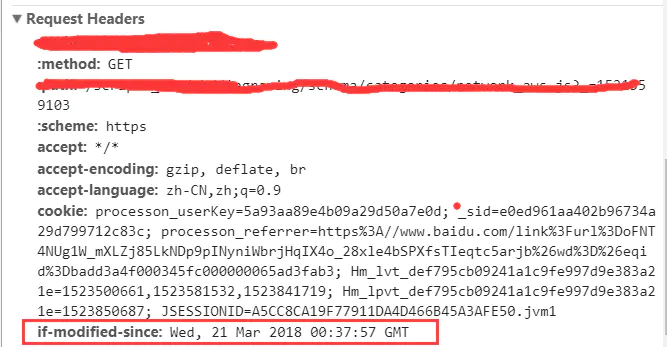

#### Etag / If-None-Match
+ `Etag`是服务器响应请求时，返回当前资源文件的一个唯一标识(由服务器生成)，如下。

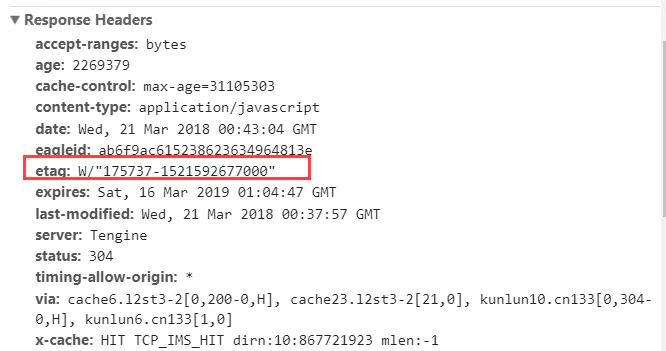

+ `If-None-Match`是客户端再次发起该请求时，携带上次请求返回的唯一标识`Etag`值，通过此字段值告诉服务器该资源上次请求返回的唯一标识值。服务器收到该请求后，发现该请求头中含有`If-None-Match`，则会根据`If-None-Match`的字段值与该资源在服务器的`Etag`值做对比，一致则返回304，代表资源无更新，继续使用缓存文件；不一致则重新返回资源文件，状态码为200，如下。

> 注：`Etag / If-None-Match`优先级高于`Last-Modified / If-Modified-Since`，同时存在则只有`Etag / If-None-Match`生效。

# 总结
强制缓存优先于协商缓存进行，若强制缓存(`Expires`和`Cache-Control`)生效则直接使用缓存，若不生效则进行协商缓存(`Last-Modified / If-Modified-Since`和`Etag / If-None-Match`)，协商缓存由服务器决定是否使用缓存，若协商缓存失效，那么代表该请求的缓存失效，重新获取请求结果，再存入浏览器缓存中；生效则返回304，继续使用缓存，主要过程如下：

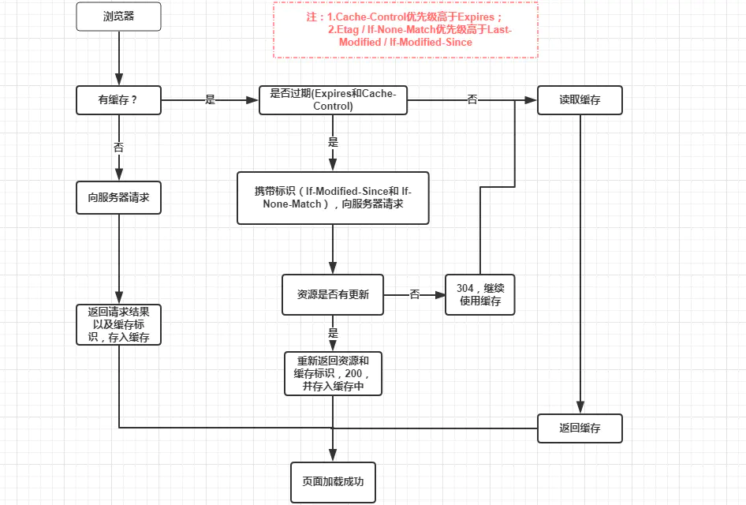

<Vssue :title="$title" />
